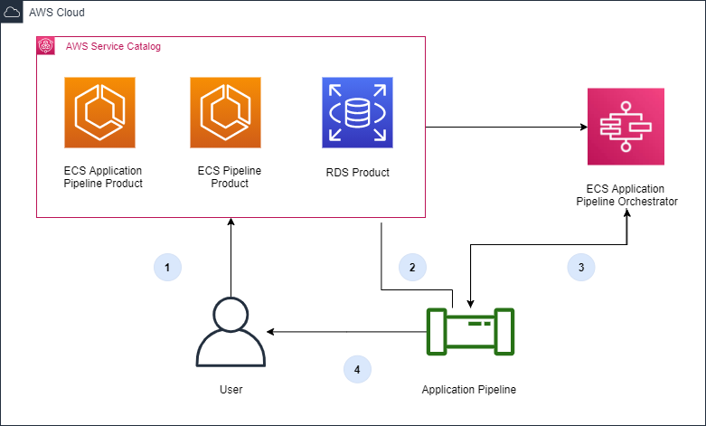

# Pipeline Foundations Blueprint

The Pipeline Foundation solution enables application teams to request  a deployment pipeline that comes with all of the necessary components, integrations, and configuration for the team to deploy their code.

## **Installation** ##
1. Create an S3 bucket (or use an existing bucket) that will serve as the main source of CloudFormation templates. Update the `S3RootURL` paramater in `install.sh` with the bucket name *TODO*
2. After cloning repository on local machine, navigate to deploy/ and run the `install.sh` script.
    * If deploying for multiple accounts, change the `childAcc=""` parameter in `install.sh` to a space delimited list of child accounts (DO NOT include the account from which this is initially deployed) such as: `childAcc="1234567890 0987654321"`
3. This will create cross-account StackSet roles if neccesary.
4. The automated Service Catalog pipeline stack (SC-IACPipeline) will be deployed. This is the pipeline that will gather the Service Catalog templates and sync them to S3 and then deploy the Service Catalog portfolios and products.

## **Instructions for adding/updating a product**
For Pipeline Foundations, products will most often be CodePipeline deployment pipelines that are customized for a specific use case. These pipelines rely on products that are made available through the Infrastructure, Environment, and Compliance Foundations. Products that are not deployment pipelines but are products that aide or enhance a deployment pipeline would be included here.

### For a new product:
1. 2 CloudFormation templates are required for each product (a CloudFormation template containing the product and a CloudFormation template that creates the Service Catalog product).
2. Create a folder in the `products/` directory with the name of your product (lower-kebab-case).
3. Add both CloudFormation templates into the newly created folder.
4. Commit and merge. The pipeline will pick up the changes and deploy the new product.

### For updating a product
1. *TODO*
